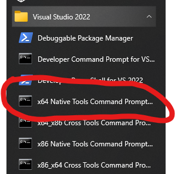

# Introduction

3 gestionnaires de projets de java dans l'ordre chronologique

- Ant
- maven: il a eu le monopole pendant un long moment. Il a plein d'avantages mais a aussi des incovénients
  - inconvénients: la ligne de commande est complexe, le fichier de configuration est verbeux et complexe
  - Avantages: propose les test de base, peut être étendu via des plugins, il y une forte communauté, et en cherchant bien on arrive à son objectif
  - Créer un projet basique: `mvn archetype:generate -DgroupId=com.mycompany.app -DartifactId=my-app -DarchetypeArtifactId=maven-archetype-quickstart -DarchetypeVersion=1.4 -DinteractiveMode=false`
    - Pour Powershell (il n'aime pas les argument qui commencent avec -): `mvn archetype:generate "-DgroupId=com.mycompany.app" "-DartifactId=my-app" "-DarchetypeArtifactId=maven-archetype-quickstart" "-DarchetypeVersion=1.4" "-DinteractiveMode=false"`
  - -DgroupId: nom du package (mon nom de domaine inversé)
  - -DartifactId: identifiant unique du projet (par exemple: java-rest-client)
  - Archétype: template de projet
  - Artéfact: un projet
  - archetypeArtifactId: nom du projet du template. En d'autres termes, le nom du template
  - `mvn archetype:generate` va générér un projet à partir d'un template enregistré dans le nexus
  - Nexus: c'est un site en ligne qui centralise toutes les libraires et templates
  - archetypeVersion: version du template
  - interactiveMode: permet de savoir si maven peut poser des questions à l'utilisateur
- gradle: utilisé en premier per le devs Android et coexiste avec maven dans le monde du backend
  - Plus moderne que maven, moins verbeux

# Utiliser maven

- Ajouter cette configuration au plugin jar dans le pom.xml (à ne faire qu'une fois pour votre projet)

```xml
<configuration>
  <archive>
    <manifest>
      <mainClass>com.cours.App</mainClass>
    </manifest>
  </archive>
</configuration>
```

- Générer un jar `mvn compile jar:jar`
  - Un jar est juste une archive zip avec une arborescence particulière. Son utilisé principale est de contenir les .class
- Lancer le jar `java -jar .\target\java-rest-client-1.0.jar`

## GraalVM

- Dans votre pom, ajouter cette balise entre les parties `dependencies` et `build`. N'oubliez pas de spécifier les propriétés: `native.maven.plugin.version` (la version la plus récente à date est la 0.9.18) et votre `mainClass`.

```xml
<profiles>
  <profile>
    <id>native</id>
    <build>
      <plugins>
        <plugin>
          <groupId>org.graalvm.buildtools</groupId>
          <artifactId>native-maven-plugin</artifactId>
          <version>${native.maven.plugin.version}</version>
          <extensions>true</extensions>
          <executions>
            <execution>
              <id>build-native</id>
              <goals>
                <goal>compile-no-fork</goal>
              </goals>
              <phase>package</phase>
            </execution>
            <execution>
              <id>test-native</id>
              <goals>
                <goal>test</goal>
              </goals>
              <phase>test</phase>
            </execution>
          </executions>
          <configuration>
            <imageName>jrc</imageName>
            <mainClass>${mainClass}</mainClass>
            <buildArgs>
              <buildArg>--link-at-build-time</buildArg>
              <buildArg>--no-fallback</buildArg>
              <buildArg>-H:+ReportExceptionStackTraces</buildArg>
            </buildArgs>
          </configuration>
        </plugin>
      </plugins>
    </build>
  </profile>
</profiles>
```

- Installer Visual Studio et les composants suivants:
  - Développement Desktop C++
  - SDK Windows 10 (dernière version disponible)
  - Cela vous donner accès à un terminal
- Installer graalvm: `scoop install graalvm`
- Installer le composant 'native-image' en suivant [ces instructions](https://graalvm.github.io/native-build-tools/latest/graalvm-setup.html#_3_native_image_tool_instalation):
  - avec un invite de commande (pas powershell): `%GRAALVM_HOME%/bin/gu install native-image`
- Les compilation en natif nécessite de fournir des fichiers de configuration à GraalVM. Ces derniers peuvent être générés automatiquement et il suffira de les déposer dans le dossier META-INF
  - Dans le fichier `pom.xml`, Ajoutez ou mettez à jour le plugin `maven-compiler-plugin` de cette façon:

```xml
<plugin>
  <artifactId>maven-compiler-plugin</artifactId>
  <version>3.10.1</version>
  <configuration>
    <annotationProcessorPaths>
      <path>
        <groupId>info.picocli</groupId>
        <artifactId>picocli-codegen</artifactId>
        <version>${picocli.version}</version>
      </path>
    </annotationProcessorPaths>
    <compilerArgs>
      <arg>-Aproject=${project.groupId}/${project.artifactId}</arg>
    </compilerArgs>
  </configuration>
</plugin>
```

- Lancer un `mvn compile` qui va générer nos fichiers de configuration, sous forme de fichiers json, dans le dossier `target/classes/META-INF/native-image/picocli-generated/${project.groupId}/${project.artifactId}`
- Nous allons maintenant appliquer la configuration à GraalVM
  - Déplacer le dossier `target/classes/META-INF/native-image` (et son arborescence avec) dans le dossier `src/main/resources/META_INF`:
    - En powershell cela donnerait: `mv .\target\classes\META-INF\native-image\ .\src\main\resources\META-INF\`
  - Ceci nous donner arborescence suivante: `src/main/resources/META_INF/native-image/picocli-generated/${project.groupId}/${project.artifactId}`
  - Remonter `${project.groupId}/${project.artifactId}` d'un cran
    - En Powershell cela donnerait: `mv .\src\main\resources\META-INF\native-image\picocli-generated\* .\src\main\resources\META-INF\native-image\`
  - Supprimer le dossier `picocli-generated`
  - Créer un fichier `native-image.properties` Dans le dossier `src/main/resources/META-INF/native-image/${project.groupId}/${project.artifactId}/` avec le contenu suivant: `-H:ReflectionConfigurationFiles=reflect-config.json`
- Nous sommes maintenant prêts pour générer le binaire natif. Ouvrir un terminal natif x64 de Visual Studio:



- Naviguer jusqu'au dossier du projet dans ce terminal.
- Lancer la commande: `mvn -Pnative -DskipTests package`
