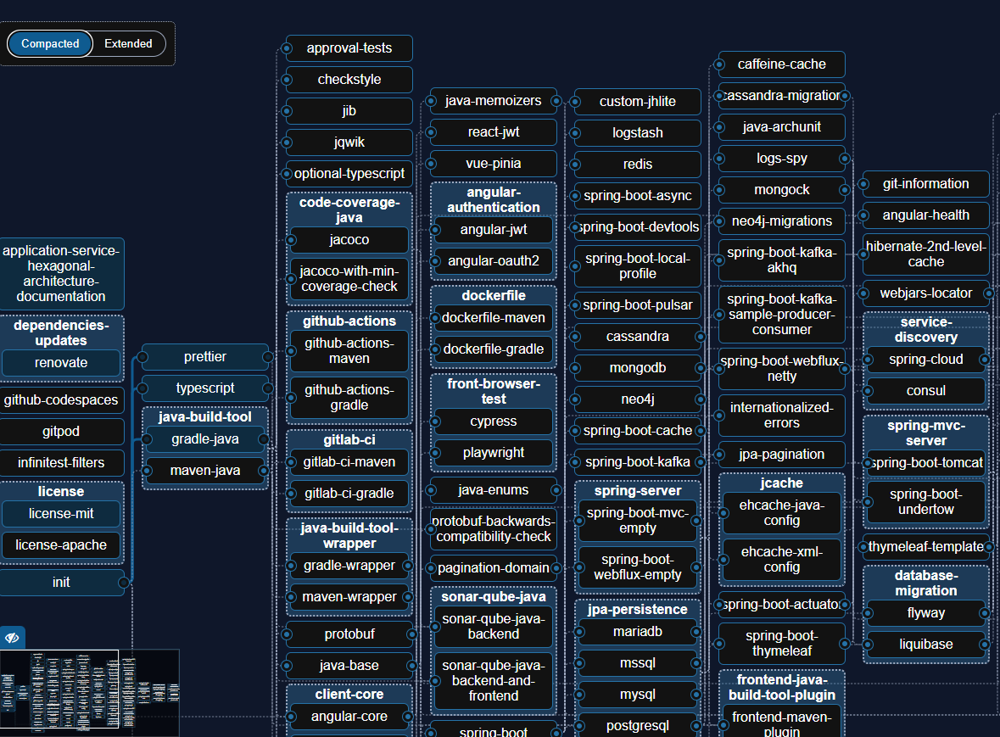

# A tour of CLI tools for installing Java and creating projects

Java Developers have at their disposal many tools and libraries that make their DX (Developer eXperience) easier and more fun.

Being a terminal lover, let me share with you some CLI (Command Line Interface) tools that'll make installing the JDK and and bootstraping projects a breeze.
You can even complement your existing tooling with the ones that we'll see here.

💡 This post is also valid if you use Kotlin for the JVM.

## JDK version management

Let's start with the first thing that we need to do when we want to start a Java project: installing the JDK.

With Java releasing a new version every 6 months and with all the available JDK distributions, having a proper JDK version management is a must.
Thus, I strongly discourage to install a JDK using an installer.
In addition to that, some JDKs have license costs in production environments and we need to be careful about that.
So, I discourage installing a JDK from search engines without proper prior knowledge, such as the one offered by [whichjdk.com](https://whichjdk.com).

Instead, we can use an intermediary tool that will allow to install different JDKs and change the default one whenever we want.
This kind of tool is called a Java version manager.
I recommend these two tools depending on your OS.

- On Windows: [scoop](https://scoop.sh/) is a package maanger which supports Java version management. It provides a [Java wiki](https://github.com/ScoopInstaller/Scoop/wiki/Java) with detailed instructions.
- On Linux and macOS: [SDKMAN!](https://sdkman.io/) is a SDK manager specialzed in the Java ecosystem. Instructions on how to manage JDKs is [provided here](https://sdkman.io/usage).

In addition to listing and installing JDKs with different version and providers, these tools can change the current active JDK in a single command (by automatically updating JAVA_HOME and PATH environment variables).
Furthermore, we can install in a single command other Java related tools such as maven, gradle, Kotlin, etc.

For example, to list the available JDKs using scoop, we run `scoop search jdk` to get an output similar the following one:

```sh
...
temurin17-nightly-jdk     17.0.10-6.0.202312241232  java
temurin18-jdk             18.0.2-101                java
temurin18-nightly-jdk     18.0.2-101.0.202210032342 java
temurin19-jdk             19.0.2-7                  java
temurin19-nightly-jdk     19.0.2-7.0.202302250348   java
temurin20-jdk             20.0.2-9                  java
temurin21-jdk             21.0.1-12.1               java
temurin8-jdk              8.0.392-8                 java
temurin8-nightly-jdk      8.0.402-5.0.202312251854  java
zulu-jdk                  21.30.15                  java
zulu10-jdk                10.3.5                    java
zulu11-jdk                11.68.17                  java
zulu12-jdk                12.3.11                   java
zulu13-jdk                13.54.17                  java
zulu14-jdk                14.29.23                  java
...
```

We note that there are plenty of choices.
My general recommendation is to use the latest LTS release and a distribution which provides the best balance of features (license, community, performance, security updates, etc.).
In this regard, I use either Zulu JDK or Temurin JDK.
This seems to be in-line with [whichjdk.com](https://whichjdk.com/) which recommends to use [Adoptium Eclipse Temurin 21](https://whichjdk.com/#adoptium-eclipse-temurin) (which superseeds adoptopenjdk) (Please note that Java 21 is the current LTS at the time of writing).

So let's install Temurin with scoop `scoop install temurin21-jdk` or with SDKMAN! `sdk install java 21.0.1-tem`.
Once done, you can immediatly check that with a `java --version` that the setup was successul.

## Projects managers

In this section, I'll show three tools for creating and managing Java projects from the command line.

### JBang

[JBang](https://www.jbang.dev/) is one of the simplest and easiet ones to get started with Java.
In fact, it allows to create self-contained source-only projects, where build configuration files are not needed.
This means that a JBang project can fit in a single Java (or Kotlin) file.

This tool also provides [an AppStore](https://www.jbang.dev/appstore/) feature which allows to run java projects shared by the community very easily.
⚠ Of course, every script must be verified before running it on your machine.

JBang can be installed on Windows with [scoop](https://scoop.sh/): `scoop install jbang`, or on macOS and Linux with [SDKMAN](https://sdkman.io/) `sdk install jbang`.

After that, we can create a basic project with `jbang init hello.java`. We can run it with `jbang run hello.java` (On Linux and macOS, we first need to run `chmod +x hello.java` to make the java file executable).

JBang provides many other templates that we can list with `jbang template list`.
Here is the output of this command at the the time of writing this post.

```sh
agent = Agent template
cli = CLI template
githubbot@quarkusio = Example of making a github app
gpt = Template using ChatGPT (requires --preview and OPENAI_API_KEY)
gpt.groovy = Template using ChatGPT for groovy (requires --preview and OPENAI_API_KEY)
gpt.kt = Template using ChatGPT for kotlin (requires --preview and OPENAI_API_KEY)
hello = Basic Hello World template
hello.groovy = Basic groovy Hello World template
hello.kt = Basic kotlin Hello World template
qcli = Quarkus CLI template
qmetrics = Quarkus Metrics template
qrest = Quarkus REST template
readme.md = Basic markdown readme template
```

The `cli` template create a starter project with `picocli` which is a great library for creating console apps that consume command-line arguments.

Another way to create projects is use the help OpenAI's API (the one behind chatGPT) to generate one based on a prompt.
This feature is still experimental but it looks promising as shown in [this blog post](https://www.infoq.com/news/2023/06/jbang-107/).
I couldn't get it to work on my free key (Maybe I didn't set it up correctly).

I personally used JBang to create Java projects for solving some advent of codoe challenges and it was really useful.
The JBang community was also reactive to my feedback and fixed my issues very quickly.
Big thanks to them!

To summarize, JBang is particularly adapted for education, for small projects or to try tools or templates available in its AppStore (as long as we make sure they are safe beforehand).

### Gradle

Gradle is project management tool used by Android developers by default and also by Java developers as an alternative to maven.
Even though it seems to be mostly used by Kotlin or Java devs, gradle is language agnostic and supports other languages as well.

In addition to project management, gradle provides a `gradle init` command which bootstraps a blank or a *hello world* project.
Let's try this out and create a Java project from scratch.
The following snippet show a terminal interaction with the introduced command.

```sh
➜ gradle init

Select type of project to generate:
  1: basic
  2: application
  3: library
  4: Gradle plugin
Enter selection (default: basic) [1..4] 2 # Choose 2 for a 'Hello world' project

Select implementation language:
  1: C++
  2: Groovy
  3: Java
  4: Kotlin
  5: Scala
  6: Swift
Enter selection (default: Java) [1..6] 3 # Choose 3 for Java

Generate multiple subprojects for application? (default: no) [yes, no]

Select build script DSL:
  1: Kotlin
  2: Groovy
Enter selection (default: Kotlin) [1..2] # Leave default to use Kotlin script for the build file

Select test framework:
  1: JUnit 4
  2: TestNG
  3: Spock
  4: JUnit Jupiter
Enter selection (default: JUnit Jupiter) [1..4] # Leave default to use JUnit Jupiter

Project name (default: gradle-java): # Leave default to use the folder name as the project name

Source package (default: gradle.java): # Leave default to use the suggested package name

Enter target version of Java (min. 7) (default: 17): # Leave default to use your current Java version

Generate build using new APIs and behavior (some features may change in the next minor release)? (default: no) [yes, no]


> Task :init
To learn more about Gradle by exploring our Samples at https://docs.gradle.org/8.5/samples/sample_building_java_applications.html

BUILD SUCCESSFUL in 31s
2 actionable tasks: 2 executed
```

Once the project is generated, we can immediately open it or run it.
We can verify this follows the usual gradle project structure.
Even a test case is provided out of the box!.

```sh
│   .gitattributes
│   .gitignore
│   gradlew
│   gradlew.bat
│   settings.gradle.kts
│
├───app
│   │   build.gradle.kts
│   │
│   └───src
│       ├───main
│       │   ├───java
│       │   │   └───gradle
│       │   │       └───java
│       │   │               App.java
│       │   │
│       │   └───resources
│       └───test
│           ├───java
│           │   └───gradle
│           │       └───java
│           │               AppTest.java
│           │
│           └───resources
└───gradle
    │   libs.versions.toml
    │
    └───wrapper
            gradle-wrapper.jar
            gradle-wrapper.properties
```

Once the project is created, we can run it using `gradle run` and launch the tests using `gradle test`.

### Maven arcehtype:generate

`maven` is a Java project management which was predominant (who [said ant](https://stackoverflow.com/questions/39645836/did-maven-killed-the-ant-or-it-is-still-alive) ☺) before `gradle` and `jbang` appeared.

Among its features, the `maven arcehtype:generate` command allows to generate various types of projects from templates.
The only requirement is to run the command with the correct template information: its `archetypeGroupId`, `archetypeArtifactId` and `archetypeVersion`.

Locally installed templates can be listed by running `mvn archetype:generate` and many more can be found by searching on the internet.
Calling `mvn archetype:generate` on my computer listed more than **3000** projects, which can be a bit overwhelming for beginners.

We must also be careful because the quantity does mean quality, for example, to create a simple Java project, we run this command that we find in the official [maven website](https://maven.apache.org/archetypes/maven-archetype-quickstart/):

```sh
mvn archetype:generate -DarchetypeGroupId=org.apache.maven.archetypes -DarchetypeArtifactId=maven-archetype-quickstart -DarchetypeVersion=1.4
# in powershell, prefix the - with a `
mvn archetype:generate `-DarchetypeGroupId=org.apache.maven.archetypes `-DarchetypeArtifactId=maven-archetype-quickstart `-DarchetypeVersion=1.4
```

When we open the created project, we find that it's using Java 7 while the current LTS version of Java at the time of writing is Java 21.

```xml
<properties>
    <project.build.sourceEncoding>UTF-8</project.build.sourceEncoding>
    <maven.compiler.source>1.7</maven.compiler.source>
    <maven.compiler.target>1.7</maven.compiler.target>
</properties>
```  

I have also encountered this issue with other archetypes but it is surprising that the one provided by the official website is so much outdated.

### JBang vs Gradle vs maven

As you may have guessed by reading the previous section, my least favorite way of creating a Java project in the command line is maven's `archetype:generate` for these reasons:

- Long commands
- We need to look for them in the internet or in a long list of templates
- We may find outdated templates, even from the official website

Maven being out of the way, let's continue by comparing `gradle init` and JBang.
They both support languages other than Java, namely Groovy and Kotlin, but JBnag's support for those is still experimental and `gradle init` supports more languages (such as C++ and Swift).

JBang is adapted for small Java projects or for ones that have a template.
For example, and as far as I know, only JBang provides a `picocli` starter.
`gradle init` is a better choice large projects that want to start from scratch and want to have a folder structure. However, if you want to create a project with a specific Java framework, you may need to use the tools provided by the framework:

- Spring boot: [spring initializr](https://start.spring.io/) or [Spring Boot CLI](https://docs.spring.io/spring-boot/docs/current/reference/html/cli.html)
- Quarkus: [code.quarkus.io](https://code.quarkus.io/) or [Quarkus CLI](https://quarkus.io/guides/cli-tooling)
- JEE: [Open Liberty starter](https://openliberty.io/start/), [Eclipse starter for Jakarta EE](https://start.jakarta.ee/), [Wildlfy quickstart projects on GitHub](https://github.com/wildfly/quickstart)

To summarize, we have many tools at our disposal and all provide great features.

In next chapters, let's explore the above introduced tools.

### Spring Boot CLI and Quarkus CLI

Two of the most famous Java server frameworks, namely [Spring](https://spring.io/) and [Quarkus](https://quarkus.io/), provide CLIs for improving DX.

[Spring Boot CLI](https://docs.spring.io/spring-boot/docs/current/reference/html/cli.html) generates new Spring boot projects and encodes passwords (for use with Spring Security).
The project generation feature is the CLI counterpart of the web UI [start.spring.io](https://start.spring.io/).
Below are some examples of using the Spring Boot CLI:

```sh
# Generate a zip file that contains a Kotlin project which uses Gradle Kotlin build file and inclids the web-services and postgresql dependencies
spring init --build gradle -l kotlin -t gradle-project-kotlin -d web-services,postgresql
# Generate a Java 21 project that uses maven and includes the web-services and postgresql dependencies
spring init -x --build maven -j 21 -a sb-cli-demo -g org.sb.test -d web-services,postgresql --description "project created with Spring Boot CLI"
# List all possible options to initialize a project
spring help init
```

Spring Boot CLI features are very basic.
Some features that I miss are upgrading spring version and adding new dependencies.
Maybe they'll be implemented in the future.
But as it is right now, I don't need to keep it installed in my computer.

[Quarkus CLI](https://quarkus.io/guides/cli-tooling) provides much more features than Spring Boot CLI.
Not only it allows to create new Quarkus projects, but it's also able to manage other lifecycle tasks: running dev mode, building for production, upgrading versions, etc.
Thus, it can be used instead of gradle or maven for most tasks.
This makes the DX with Quarkus much more universal and agnostic of the underlying build tool (gradle or maven).

Here are some sample uses of quarkus cli:

```sh
# List available quarkus extension
quarkus ext ls
# Create a Quarkus app (server)

# Run the app in dev mode

```

```sh
# Create a Quarkus CLI app (with Picocli) that uses Kotlin and Gradle with Kotlin DSL
quarkus create cli --name="quarkus-cli-demo" --kotlin --gradle-kotlin-dsl --wrapper
# Open the folder
cd code-with-quarkus
# run the app with gradle
./gradlew quarkusRun -Dquarkus.args='-c -w --val 1' --console=plain
# Run the app with quarkus cli (this fails at the time of writing)
quarkus run -Dquarkus.args='-c -w --val 1'
```

Quarkus CLI is a very interesting and useful tool which is a must-have for Quarkus devs.
I personally used it to migrate a [Quarkus project](https://blog.worldline.tech/2023/12/26/feedback_upgrade_quarkus_2_3.html) and this tool helped me a lot!
I was also surprised to discover that we can create a picocli app with Quarkus.
So, please give it a try.

## Project scaffolders

We have seen earlier that JBang, Gradle and Maven are able to generate projects from scratch.
Scaffolding goes a bit further by also generating other layers of the app (database, front-end, etc.).

### Yeoman

Yeoman is a general purpose project scaffolder which is framework and language agnostic.
Even though the tool itself relies on npm (which is installed alongside nodeJS), it can generate any type of project as long as the corresponding project generator is available.
A project generator defines how to scaffold a set of projects.
Fortunately for us, we can explore generators in the [discover page](https://yeoman.io/generators/) and search for the one that we need in a webUI.
There we can find for example, starter projects for VSCode extensions, Office extensions, webaaps, or even servers.

Anyone can create a [project generator](https://yeoman.io/authoring/) and publish it to npm so that it is available in the [yeoman search engine](https://yeoman.io/generators/).

In order to generate a yeoman project locally, we first need to install yeoman with `npm i -g yo`.
Next, we install the generator with `npm install -g [generator]`.
For example, the [generator-jvm](https://github.com/daggerok/generator-jvm) can be installed `npm install -g generator-jvm` and provides some JVM project generators.
Finally, we need to run the generator with `yo generator`
For example, to generate a JVM project, we can run `yo jvm`.

For Java developers, there is a more tailored scaffolder based on Yeoman which is called JHispter.

### JHipster and JHipsterLite

JHipster is a project scaffolder specialized in Java projects.
It generates ready-to-use full stack projects with a database, a Java backend, a web frontend and different common service.
The backend is based on Spring Boot with Java and the frontend is based on Angular, React or Vue.

The tool works by asking questions to the user and generating the project based on the answers.
Here is an example of the questions asked and the anwsers that I gave when creating a new project:

```sh
? What is the base name of your application? jhispterDemo
? Which *type* of application would you like to create? Monolithic application (recommended for simple projects)
? What is your default Java package name? com.mycompany.myapp
? Would you like to use Maven or Gradle for building the backend? Gradle
? Do you want to make it reactive with Spring WebFlux? Yes
? Which *type* of authentication would you like to use? JWT authentication (stateless, with a token)
? Besides JUnit, which testing frameworks would you like to use?
? Which *type* of database would you like to use? SQL (H2, PostgreSQL, MySQL, MariaDB, Oracle, MSSQL)
? Which *production* database would you like to use? PostgreSQL
? Which *development* database would you like to use? PostgreSQL
? Which cache do you want to use? (Spring cache abstraction) Ehcache (local cache, for a single node)
? Do you want to use Hibernate 2nd level cache? Yes
? Which other technologies would you like to use? Elasticsearch as search engine, Apache Kafka as asynchronous messages broker
? Do you want to enable Gradle Enterprise integration? No
? Which *framework* would you like to use for the client? React
? Besides Jest/Vitest, which testing frameworks would you like to use? Cypress
? Do you want to generate the admin UI? Yes
? Would you like to use a Bootswatch theme (https://bootswatch.com/)? Default JHipster
? Would you like to enable internationalization support? Yes
? Please choose the native language of the application French
? Please choose additional languages to install English
? Would you like to audit Cypress tests? Yes
```

One the project is created, the database can be designed with [JDL Studio](https://start.jhipster.tech/jdl-studio/) and imported into the project.

[Jhipster Lite](https://lite.jhipster.tech/) (or JHLite) is the web counterpart of JHipster.
It is not feature-equivalent to JHipster but it allows to create a project from a web UI.
[This page](https://www.jhipster.tech/jhipster-lite/) notes that JHLite it is better suited for designing around business and XDD approaches (eXtreme Design Driven).



Both JHipster and JHLite are very useful for quickly prototyping or for projects that use the same technologies provided by them.
However, the opinionated nature of the generated code and selected frameworks may not suit everyone.
For example, Quarkus is not supported by JHipster and we need to use the [Quarkus CLI](https://quarkus.io/guides/cli-tooling) to generate a Quarkus project.

### Advantages and drawbacks

Project scaffolders allow to get a project running really fast where a lot of boilerplate code is already written for us.
Thus the gain in terms of effort and time is considerable.
However, the generated code may not coincide with the developer's way of coding.
Also, some choices are very opinionated, such as the exclusive use of Spring on JHipster.
There's also the issue of vendor-locking where we must update our project using tools provided by the scaffolder if we don't want to take the risk of breaking the dependencies.
In addition to that, since we are dealing with a community project, we face the usual issues of trust and updates.
For example, when I installed Yeoman (on January 2024), npm detected 7 high vulnerabilities.

```sh
➜ npm install -g yo

added 801 packages, and audited 802 packages in 1m

122 packages are looking for funding
  run `npm fund` for details

13 vulnerabilities (6 moderate, 7 high)
```

So, in my opinion, scaffolders are quite relevant for prototypes, PoCs or when we have tight deadlines.
For long term projects, I would avoid to use a scaffolder so that I keep more control over my code, instead, I'd rather use official tools to generate the projects.
For exmaple, to develope a Quarkus + Vue proejct, I'll use [Quarkus CLI](https://quarkus.io/guides/getting-started) or [code.quarkus.io](https://code.quarkus.io/) to create the Quarkus project and [vite](https://vitejs.dev/guide/) to create a Vue project.
Of course, this is my current personal opinion which may change in the future.

## Conclusion

This post has shown how to get advantage of the command line tools to install a JDK and to create new projects.
We first have seen how to install and manage Java JDKs with `scoop` and `SDKMAN!`.
Next, we studied some tools that create Java projects whicha are `JBang`, `gradle` and `maven`.
After that, we have compared `Spring Boot CLI` and `Quarkus CLI` which are specialized for their respective frameworks.
Finally, we have seen how to scaffold projects with `Yeoman`, `JHipster` and `JHipsterLite`.

I have also shared my opinion on the use of these tools.
To summarize, I recommend to use CLI tools as much as possible depending on the use case to avoid GUIs and to keep the DX as simple as possible.

I hope that this post has been useful to you and that you have discovered new tools that will make your Java development experience more enjoyable.

## Links

- [Which Java JDK Should You Use?](https://incusdata.com/blog/which-java-jdk-should-you-use)
- [cropped-java-craftsman-duke image from Marcus Biel](https://marcus-biel.com/cropped-java-craftsman-duke-png/)
